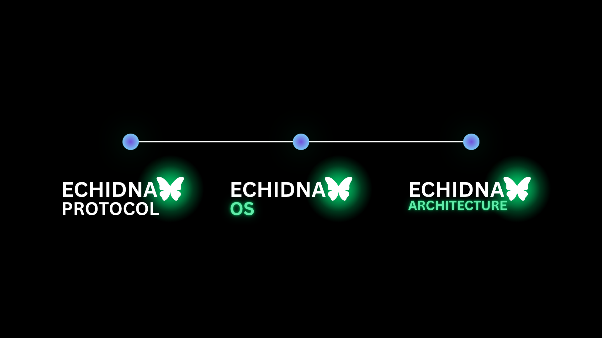
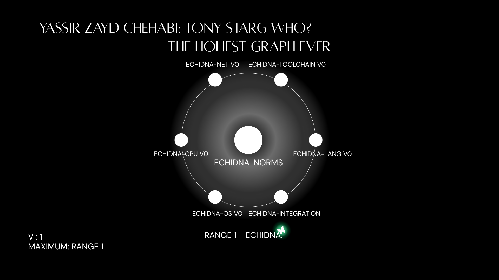

<div align="center">

<sub>v.1.1</sub>

<br/>


<br/><br/>


<br/>

**creator name:** yassir zayd chehabi

</div>

## Description

Echidna — a full computing stack designed from one specification. Custom CPU, OS, language, toolchain, and an anonymous network protocol, all conforming to `echidna-norms`. No inherited assumptions.

## Projects Included

<div align="center">

</div>

## Repo Structure

```
ECHIDNA/
├── norms/          # Specifications & architecture docs
├── cpu/            # Custom CPU / emulator / ISA implementation
├── lang/           # Compiler / lexer / parser
├── os/             # Kernel source & bootloader
├── toolchain/      # Assembler, linker, tools
├── net/            # Networking protocol stack
├── integration/    # System tests & full-stack integration
├── .gitignore      # Ignores build artifacts (.o, binaries, build/)
├── LICENSE         # Open-source license (MIT/GPL)
└── README.md       # The main landing page
```

## The Holiest Graph Ever

This graph describes the project structure — starting from the center and expanding outward to the rims, until the circle is fully complete, project by project.

<div align="center">

</div>
