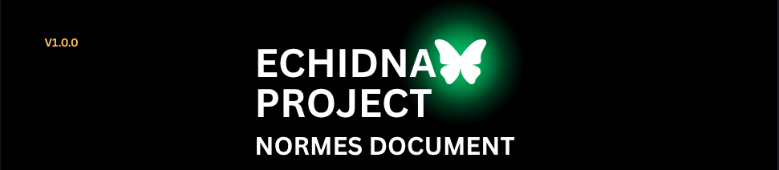
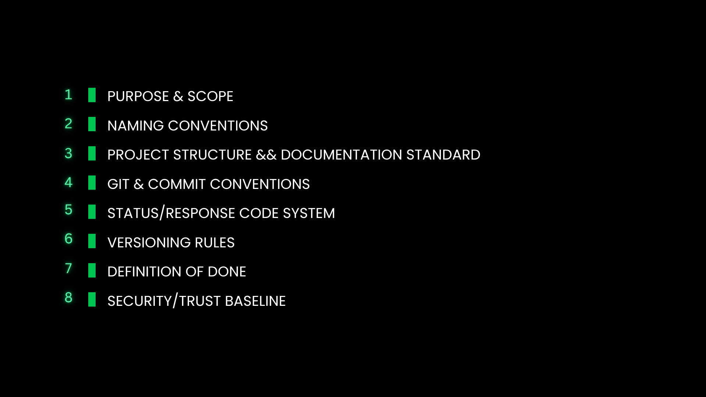
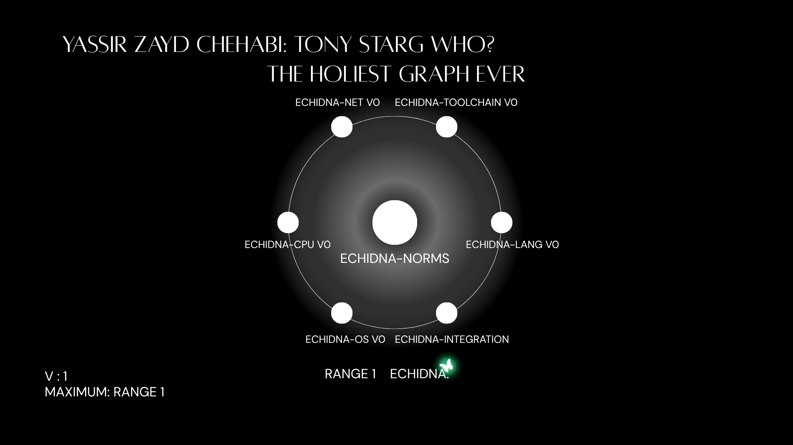

<div align="center">

<sub>v.1.0.0</sub>

<br/>



<br/><br/>


<br/>

**creator name:** yassir zayd chehabi

</div>

## Description

norms/ — The foundational engineering baseline and architectural specifications governing the platform. Establishes core standards, design philosophy, and system-level interface specifications.

## Projects Included

<div align="center">

</div>

## Repo Structure

```
norms/
 ├── assets_norms
 │   ├── echidna_norms_banner.png
 │   ├── NOMS_GIF_ECHIDNA.gif
 │   ├── NOMS_GIF_ECHIDNA.png
 │   └── succession.png
 ├── echidna_official_norms_document_v1.0.0.pdf
 ├── headers
 │   ├── echidna_header.vim
 │   └── echidna-header_vscode_
 │       └── echidna-header
 │           ├── echidna-header-0.1.0.vsix
 │           ├── extension.js
 │           ├── package.json
 │           ├── README.md
 │           └── src
 └── README.md


```

## The Holiest Graph Ever

This graph describes the project structure — starting from the center and expanding outward to the rims, until the circle is fully complete, project by project.

<div align="center">

</div>